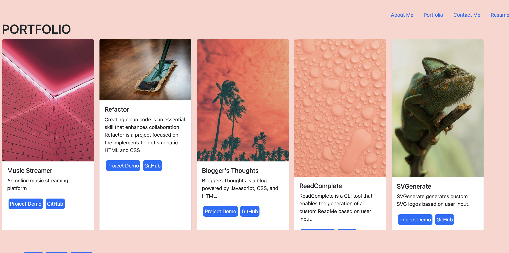

 

# Portfolio

This is my portfolio showcasing my projects powered by React! 

## Table of Contents
- [Features](#features)
- [Technologies used](#technologies)
- [Usage](#usage)
- [Visuals](#visuals)
- [License](#license)
- [Contributing](#contributing)
- [Tests](#tests)
- [Questions](#questions)

## Features

### 1. Downloadable resume
- The portfolio includes a link to download my resume.

### 2. Portfolio views
- Users can click on a project to learn more about it.

## Technologies used

- React
- Node.js
- Express.js
- Bootstrap
- JavaScript

## Visuals

User interface

## Contributing

Contributions to this application are welcome! 

Follow these steps to contribute:

1. Fork the repository.

2. Create a new branch for your feature or enhancement.
3. Make your changes and commit them, following best practices for commit messages.
4. Push your changes to your forked repository.
5. Submit a pull request with a clear description of your changes.

## License

This project is licensed under the MIT License.

## Acknowledgements

This project was developed and executed by Owen and Jasmine as a part of a class project.
# challenge-20